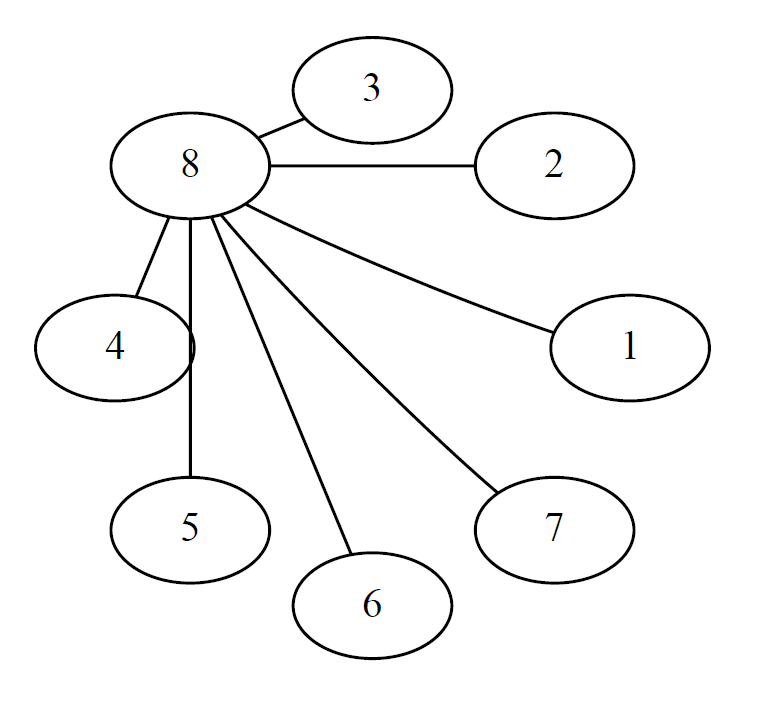

Documentation
=============

Design Matrix
-------------
The :func:`main.get_design` function can be used to retrieve the design matrix from an
index.
The index must correspond to one in the table of :cite:t:`chen1993catalogue` or
:cite:t:`xu2009algorithmic`.
For both papers, the index is composed of three numbers representing:

* the number of factors in the design (:math:`n`)
* the number of added factors (:math:`p`, where :math:`n > p`)
* the rank, in term of abberation, of the design

Word length pattern
-------------------
In regular designs, aliasing is either full or null.
Thus, added factors are made out of interaction between basic factors, this interaction is called a generator.
If we represent basic factors by lower case letters, then an added factor can be represented by a string of all the letters corresponding to the basic factors used in its generator.
For example, consider a design in 32 runs, there are five basic factors: :math:`a,b,c,d,e`.
Consider an added factor :math:`f` made of the interaction between factors :math:`a,b,c`.
This means that the levels of factor :math:`f` are made of the interactions between the levels of :math:`a,b,c`.
Then we can write the string :math:`abcf` to represent that relation.
This string is called a **word** and has a **length** of four since it has four letters.
Multiplying words together generates other words.
For example multiplying :math:`abcf` with :math:`acde` yields the word :math:`bdef`.
Thus, a design with :math:`p` added factors has a set of :math:`2^{p}-1` words in total.

For a :math:`2^{n-p}` design :math:`D`, let :math:`A_{i}` denote
the number of words of length :math:`i` in the set of all words.
The vector

.. math::
   W(D) = \left(A_{3}, A_{4}, \ldots, A_{n} \right)

is called the word length pattern of the design :math:`D`.
The resolution of a design is the length of the shortest word in the set of all words.

The function :func:`main.get_wlp` allows you to retrieve the word length pattern of a design from the catalog.
Depending on the resolution :math:`R`, the first number in the word length pattern is :math:`A_{R}`.
For more informations about the word length pattern, see the paper of :cite:p:`wu2001generalized`.

Clear two-factor interactions
-----------------------------
A two-factor interaction, denoted a TFI, is an interaction between two two-level factors.
It can be aliased with another factor (in a word of length 3) or with another two-factor interaction (in a word of length 4).
If a TFI is not aliased with any factor or any other TFI, then it is said to be clear.
A clear TFI is interesting because it allows the estimation of the interaction without the aliasing effect of other interactions that could be active.

The function :func:`main.get_cfi` allows you to retrieve the number of clear two-factor interactions of a design from the catalog.

Clear interactions graph
^^^^^^^^^^^^^^^^^^^^^^^^
Apart from the number of clear two-factor interactions, it can also be useful to visualize which interactions are clear.
For this purpose, :cite:t:`gromping2012creating` introduced the clear interaction graph (CIG).
In such a graph, all factors are represented by nodes and if a two-factor interaction is clear, then an edge is drawn between the two nodes of the interactions.
For example, the 32-run design "8-3.4" has eight factors and 7 clear two-factor interactions that are shown on the graph below.

On the graph we see clearly that all clear two-factor interactions involve factor 8.
So one experimental variable is suspected to have high interaction effect with the others, it might be interesting to assign it to factor 8 in the experimental design.

To generate the clear interaction graph of a design, simply use the :func:`main.clear_interaction_graph` function.

Bibliography
============

.. bibliography::
